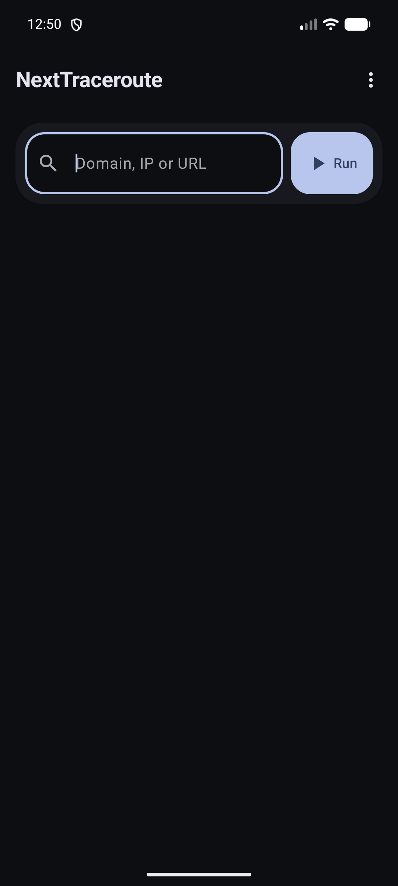

# NextTraceroute

NextTraceroute 是一款不需 Root 權限的 Android 路由追蹤應用程式。輸入網域名稱、IPv4、IPv6 或網址後，即可查看每一跳的延遲、網路業者與地理資訊。

這是持續維護中的 Android 用戶端分支，目前穩定版為 **0.2.0**。

## 主要功能

- 支援網域名稱、IPv4、IPv6 與網址輸入
- 相容 NextTrace 核心與 API 1.7.2
- 預設使用免 Token 的 v3 WebSocket／PoW 流程
- Material 3 介面、深色模式、橫向畫面與無邊界顯示
- 即時顯示追蹤進度，並可隨時停止
- 保存、搜尋、分享與刪除本機追蹤紀錄
- 支援 TraceMap、UDP／TCP DNS 與 DoH

## 系統需求

- Android 8.0（API 26）或更新版本
- 目前以 Android 17（API 37）建置與測試
- 需要網路連線

不再支援 Android 7.1 及更舊版本。

## 下載

請從本專案的 [GitHub 發佈頁面](https://github.com/alzpqm/NextTraceroute/releases) 下載最新版本。

其他應用程式商店可能仍提供舊版或由不同維護者發佈的版本，不代表本維護分支的最新狀態。

## 使用方式

1. 輸入網域名稱、IP 位址或完整網址。
2. 點選「Run」或鍵盤上的前往按鍵。
3. 等待追蹤完成；進行中可點選「Stop」。
4. 完成後可查看地圖、複製結果，或在歷史紀錄中再次開啟。

一般使用者不需要設定 API Token。應用程式會依 NextTrace 的 PoW 流程取得工作階段所需的臨時授權。

## 畫面

<p align="center">
  
</p>

## 隱私

應用程式本身不含廣告或分析服務，也不要求註冊帳號。路由追蹤必須連線至 NextTrace API 與所選 DNS 服務，這些第三方服務可能接收來源 IP、查詢目標及路由節點資訊。詳細內容請參閱[隱私權政策](PrivacyPolicy.md)。

## 問題回報

請使用本專案的 [GitHub Issues](https://github.com/alzpqm/NextTraceroute/issues) 回報錯誤或提出功能建議。回報時請勿附上 Token、密碼、裝置序號、私人 IP、真實姓名、真實電子郵件或其他敏感資料。

## 建置

需要 JDK 21 與 Android SDK 37：

```bash
./gradlew testDebugUnitTest lintDebug assembleDebug
```

推送原始碼前必須執行來源隱私掃描：

```bash
scripts/privacy-scan.sh
```

正式 APK 與 AAB 建置完成後，還必須執行產物隱私掃描：

```bash
scripts/privacy-scan.sh --artifacts
```

掃描未通過時禁止推送、建立標籤或發佈版本。

## 授權

本專案依 [GNU 通用公眾授權條款第三版](LICENSE) 發佈。NextTrace API 由第三方營運，本專案不保證其可用性、效能或資料正確性。
